# RunPin — 완성형 ERD

RunPin이 PLAN.md의 기획대로 **배포된 완성형**이라고 가정했을 때 필요한 Firestore
컬렉션 전체 구조. 지금 실제로 존재하는 것과 아직 없는 것이 섞여 있으므로, 상태를
반드시 구분해서 본다.

> 이 문서는 2026-08-21 기준 코드/`firestore.rules`/`PLAN.md`를 대조해 작성했다.
> 코드가 바뀌면(특히 좋아요·랭킹처럼 진행 중인 작업) 이 문서도 같이 갱신할 것.

## 범례

| 표시 | 의미 |
|---|---|
| ✅ **완료** | 지금 Firestore에 실제로 연동되어 동작 중. 필드는 `firestore.rules`/`lib/*.ts`에서 그대로 가져왔다. |
| 🟡 **mock 상태** | 코드/UI는 있지만 로컬 state(`useState`, 인메모리 스토어)일 뿐 Firestore 컬렉션이 없음. 완성형에서 반드시 새로 만들어야 한다. |
| ⚪ **계획만 있음** | `PLAN.md`에는 있지만 코드가 전혀 없음. 필드는 설계 추정치이며, 실제 구현 시 재검토가 필요하다. |

다이어그램의 모든 엔티티는 첫 줄에 `status` 속성으로 위 세 상태 중 하나를 표시한다
(Mermaid ER 다이어그램이 엔티티 배경색을 지정하는 기능은 GitHub 렌더러 버전에 따라
깨질 수 있어, 대신 항상 렌더되는 속성 행으로 표시했다).

## 전체 관계도

```mermaid
erDiagram
    FirebaseAuthUsers {
        string status "인프라 (Firebase Auth, Firestore 컬렉션 아님)"
        string uid PK
        string email
        string displayName
        timestamp createdAt
    }

    usernames {
        string status "완료"
        string id PK "문서ID = 닉네임 문자열"
        string uid FK
        string displayName
        timestamp createdAt
    }

    courses {
        string status "완료"
        string id PK
        string name
        array coordinates "LatLng 배열, 도로 기반 실좌표"
        string category
        number difficulty "1~5"
        number distanceKm
        string uploaderId FK
        string uploaderName
        number likeCount
        timestamp createdAt
    }

    likes {
        string status "완료 (진행 중 작업)"
        string id PK "문서ID = uid_courseId"
        string uid FK
        string courseId FK
        timestamp createdAt
    }

    runLogs {
        string status "완료"
        string id PK
        string userId FK
        array trajectory "GPS LatLng 배열"
        timestamp startedAt
        number durationSec
        number paceSecPerKm
        string courseName
        number distanceKm
        number cadenceSpm
        number avgHeartRateBpm
        array elevationSeries
        array paceSeries
        array heartRateSeries
        number difficulty "1~5"
        boolean isUploaded
        string runMateName "선택, 커뮤니티 매칭으로 함께 뛴 경우만"
    }

    users {
        string status "완료 (사진만)"
        string uid PK "문서ID = uid"
        string photoBase64 "Storage 미사용(Spark 플랜), base64 임시방편"
        timestamp updatedAt
    }

    savedCourses {
        string status "mock 상태 (SavedCourseStore, 인메모리)"
        string id PK "문서ID = uid_courseId (likes와 동일 패턴)"
        string uid FK
        string courseId FK
        timestamp createdAt
    }

    subscriptions {
        string status "mock 상태 (isSubscribed 로컬 state)"
        string uid PK, FK "문서ID = uid"
        boolean isActive
        number proposalCount "무료 제안 사용 횟수, FREE_PROPOSAL_LIMIT=5와 비교"
        string platform "ios 또는 android"
        string productId
        string originalTransactionId "IAP 영수증 원본 거래ID"
        timestamp startedAt
        timestamp expiresAt
        timestamp updatedAt
    }

    matchProposals {
        string status "mock 상태 (커뮤니티 화면 로컬 state)"
        string id PK
        string fromUid FK
        string toUid FK
        string proposalStatus "pending/accepted/declined"
        timestamp createdAt
        timestamp respondedAt
    }

    notificationSettings {
        string status "mock 상태 (알림 설정 화면 로컬 state)"
        string uid PK, FK "문서ID = uid"
        boolean propose "러닝 제안 알림"
        boolean course "코스 업데이트 알림"
        boolean community "커뮤니티 알림"
        boolean marketing "마케팅 정보 수신"
        timestamp updatedAt
    }

    liveLocations {
        string status "계획만 있음 (Feature 03 지오펜싱 백엔드)"
        string uid PK, FK "문서ID = uid"
        geopoint position
        number paceSecPerKm
        boolean isRunning
        timestamp updatedAt
    }

    matches {
        string status "계획만 있음 (types/index.ts의 죽은 타입 Match)"
        string id PK
        string matchStatus "pending/accepted/declined"
        array participantIds FK "Auth uid 배열"
        number radiusMeters
    }

    badges {
        string status "계획만 있음 (Feature 04)"
        string id PK
        string name
        string description
        string iconUrl
        string criteria "획득 조건 (자유 형식, 설계 미정)"
    }

    userBadges {
        string status "계획만 있음 (Feature 04)"
        string id PK "문서ID = uid_badgeId"
        string uid FK
        string badgeId FK
        timestamp earnedAt
    }

    courseTrajectorySignatures {
        string status "계획만 있음 (Feature 02 궤적 매칭, 필드는 추정치)"
        string courseId PK, FK "문서ID = courseId (courses와 1:1)"
        array normalizedPoints "노이즈 정규화된 궤적"
        array segmentHashes "구간 유사도 비교용 서명"
    }

    pushTokens {
        string status "계획만 있음 (알림 발송 인프라)"
        string uid PK, FK "문서ID = uid"
        string fcmToken
        string platform
        timestamp updatedAt
    }

    FirebaseAuthUsers ||--o| usernames : "claims"
    FirebaseAuthUsers ||--o{ courses : "uploads"
    FirebaseAuthUsers ||--o{ likes : "likes"
    FirebaseAuthUsers ||--o{ runLogs : "records"
    FirebaseAuthUsers ||--|| users : "has profile doc"
    FirebaseAuthUsers ||--o{ savedCourses : "saves"
    FirebaseAuthUsers ||--o| subscriptions : "subscribes"
    FirebaseAuthUsers ||--o{ matchProposals : "sends (fromUid)"
    FirebaseAuthUsers ||--o{ matchProposals : "receives (toUid)"
    FirebaseAuthUsers ||--o| notificationSettings : "configures"
    FirebaseAuthUsers ||--o| liveLocations : "broadcasts position"
    FirebaseAuthUsers ||--o{ matches : "participates (participantIds)"
    FirebaseAuthUsers ||--o{ userBadges : "earns"
    FirebaseAuthUsers ||--o| pushTokens : "registers device"

    courses ||--o{ likes : "liked via"
    courses ||--o{ savedCourses : "saved via"
    courses ||--o| courseTrajectorySignatures : "has signature"
    courses ||--o{ runLogs : "referenced by (courseName 문자열 매칭, FK 아님)"

    matchProposals ||--o| matches : "성사 시 matches 문서 생성 (설계상 연결, 미구현)"
    matchProposals ||--o{ runLogs : "성사된 러닝 → runMateName로 느슨히 연결"
    badges ||--o{ userBadges : "awarded as"
```

## 컬렉션별 상세

### ✅ 완료 (5개)

| 컬렉션 | 문서ID | 설명 |
|---|---|---|
| `usernames` | 닉네임 문자열 | 닉네임 중복 방지 전용. `get`만 공개, `list`는 막아 전수 스크래핑 방지. create가 "문서 없을 때만 성공"하는 특성을 동시 가입 경쟁 상태 방지에 이용한다. |
| `courses` | 자동 생성 | 공개 코스 카탈로그. `read`는 로그인 없이도 전체 공개. `create`는 본인 uid로만, `update`는 좋아요 토글로 인한 `likeCount` ±1만 허용(그 외 필드 불변). |
| `likes` | `uid_courseId` | **진행 중인 작업.** 좋아요 문서 생성/삭제와 `courses.likeCount` 증감을 하나의 batch로 묶어야 규칙이 통과된다. |
| `runLogs` | 자동 생성 | 본인 러닝 기록만 read 가능(비공개). 생성 후에는 "나중에 업로드" 흐름을 위해 `courseName`/`isUploaded` 두 필드만 수정 허용. |
| `users` | uid | 프로필 사진(base64)만 저장. Firebase Storage가 Blaze(유료) 플랜 전용이라 임시로 Firestore 문서에 직접 저장 중(1MiB 제한 때문에 900KB 미만으로 규칙에서 강제). |

### 🟡 mock 상태 — 지금 당장 새로 만들어야 하는 4개

| 컬렉션 | 대응하는 현재 코드 | 완성형에서 해야 할 일 |
|---|---|---|
| `savedCourses` | `lib/appData.tsx`의 `SavedCourseStore` (순수 인메모리, 새로고침/로그아웃 시 소실) | `likes`와 완전히 동일한 패턴(`uid_courseId` 문서ID)으로 옮기면 된다. 이미 `likes`가 구현돼 있으니 가장 적은 작업으로 완성 가능. |
| `subscriptions` | `lib/appData.tsx`의 `isSubscribed`/`proposalCount` 로컬 state, 구독 버튼이 그냥 `true`로 바꿈 | 실제 결제(Apple/Google IAP)가 붙으면 클라이언트가 `isActive`를 직접 못 쓰게 해야 한다 — 영수증 검증은 Cloud Functions(webhook)에서만 쓰기 권한을 갖는 구조가 정석. 지금의 "버튼 누르면 구독됨"은 심사도 통과 못 한다. |
| `matchProposals` | `app/(tabs)/community.tsx`의 `mockRunnerDots[0]` 고정 상대, 제안/수락/거절이 전부 로컬 state | 실제 다른 유저의 uid가 `fromUid`/`toUid`로 들어가야 한다. 지금은 상대가 항상 정해져 있어(무작위 매칭 로직 없음) 이 컬렉션이 생겨도 "누구에게 보낼지"는 `liveLocations`(⚪, 아직 없음)가 먼저 있어야 자연스럽게 채워진다. |
| `notificationSettings` | `app/notifications/index.tsx`의 토글 4개, 로컬 state | 필드 4개(`propose`/`course`/`community`/`marketing`)는 화면 그대로 옮기면 됨. 다만 이것만으로는 알림이 "안 오게" 막을 뿐 실제로 "오게" 만들지는 못한다 — 발송 자체는 아래 `pushTokens`(⚪)가 필요. |

### ⚪ 계획만 있음 — PLAN.md 기획, 코드 전무 (6개)

| 컬렉션 | PLAN.md 근거 | 비고 |
|---|---|---|
| `liveLocations` | Feature 03 지오펜싱 매칭의 "실시간 위치" 부분 | PLAN 10번이 "WebSocket 또는 Firestore" 둘 다 후보로 열어뒀다. 위치가 초 단위로 자주 바뀌는 데이터라 실제로는 Firestore보다 **Realtime Database가 비용/지연 면에서 더 적합할 수 있다** — 설계 확정 전 재검토 필요. |
| `matches` | `types/index.ts`에 정의만 되고 **코드 어디서도 안 쓰이는 죽은 타입** | 초기 데이터 모델 초안(PLAN 10번)의 흔적을 그대로 옮겼다. 지금의 `matchProposals`(🟡)가 accepted되면 이 문서가 생성되는 구조로 설계하면 자연스럽지만, 그 연결 코드도 없다. |
| `badges` / `userBadges` | Feature 04 "뱃지·리워드 지급" | 관련 코드가 전혀 없어 필드는 가장 느슨한 추정치. 획득 조건(`criteria`)을 코드로 어떻게 판정할지(랭킹 진입? 누적 거리?)부터 기획이 더 필요하다. |
| `courseTrajectorySignatures` | Feature 02 "궤적 매칭 모델" | 6개 중 **추정 비중이 가장 크다.** PLAN.md는 "GPS 노이즈 정규화 → 구간 유사도 계산"이라는 알고리즘 방향만 있고 저장 형식은 없음. PLAN 7번에도 "고도화 단계로 별도 분리, 초기 MVP 범위 아님"이라 명시돼 있어 배포 시점에도 없을 가능성이 높다. |
| `pushTokens` | PLAN 7번 "실시간 알림" | `notificationSettings`(🟡)가 "무엇을 받을지"를 정하는 것과 별개로, 실제로 기기에 발송하려면 FCM 토큰 저장/갱신이 필요하다. 이것 없이 `notificationSettings`만 만들면 설정 화면은 있는데 알림은 영원히 안 오는 상태가 된다. |

## 관계 읽는 법 — 헷갈리기 쉬운 3가지

1. **`runLogs.courseName`은 진짜 FK가 아니다.** 문자열 이름으로 코스를 가리킬 뿐 `courses.id`를 참조하지 않는다 (`lib/appData.tsx`의 `uploadRunLog`가 `findMatchingCourse`로 궤적을 비교해 기존 코스와 매칭하거나 새 코스를 만드는 구조). ERD에서도 이 관계를 다른 실선 FK들과 구분해 "문자열 매칭, FK 아님"이라고 라벨을 달았다.
2. **`matchProposals → matches`는 지금 코드에 존재하지 않는 연결이다.** `matchProposals`는 🟡(mock 상태, UI 있음), `matches`는 ⚪(코드 없음)이라 서로 다른 완성도 단계에 있다. "제안이 수락되면 매칭 문서가 생긴다"는 자연스러운 설계일 뿐, 실제로 그렇게 구현하라는 뜻은 아니다.
3. **`users` 컬렉션은 지금 사진 하나만 담당한다.** 완성형에서 자기소개, 러닝 통계 캐시 같은 필드가 늘어날 수 있지만, PLAN.md나 현재 코드에 구체적으로 언급된 게 없어 다이어그램에는 실제 필드(`photoBase64`, `updatedAt`)만 넣었다. 확장 필드는 필요해질 때 그 컬렉션만 다시 설계하면 된다.

## 배포 전 우선순위 제안 (참고용)

이 문서는 구조 정리가 목적이라 우선순위 결정은 아니지만, 표를 보면 자연스럽게 드러나는
순서가 있다:

1. **`savedCourses`** — `likes`를 그대로 복붙하면 되는 가장 저비용 작업.
2. **`notificationSettings`** — 화면은 이미 완성돼 있어 Firestore 연동만 하면 됨.
3. **`subscriptions`** — 필드 설계는 쉽지만 실제 IAP 검증(Cloud Functions)까지 가면 난이도가 확 오른다.
4. **`liveLocations` + `matchProposals` 실연동** — 둘이 묶여야 진짜 매칭이 된다. Feature 03 자체가 리서치에서 가장 많이 요구된 기능(PLAN 8번)이라 우선순위는 높지만 작업량도 가장 크다.
5. **`badges`/`userBadges`, `courseTrajectorySignatures`, `pushTokens`** — PLAN.md 스스로도 후순위(Feature 04, Feature 02)로 분류한 항목들.
